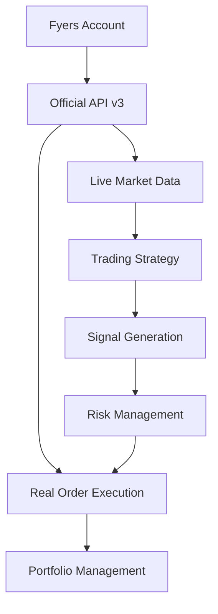

# FYERS LIVE TRADING SYSTEM - REAL DATA ONLY
## 🚨 **WARNING: LIVE TRADING WITH REAL MONEY** 🚨

[](https://myapi.fyers.in/docsv3)
[](https://myapi.fyers.in/docsv3)
[](https://myapi.fyers.in/docsv3)

Complete algorithmic trading system using **official Fyers API v3** with **REAL market data** and **LIVE order execution**.

## 🎯 **CRITICAL NOTICES**

- ✅ **OFFICIAL FYERS API v3 ONLY** - No custom/simplified clients
- ✅ **REAL MARKET DATA ONLY** - Live streaming from NSE/BSE
- ✅ **LIVE ORDER EXECUTION** - Real money trades on live markets
- ❌ **NO DEMO/DUMMY DATA** - All data is live from Fyers
- ❌ **NO PAPER TRADING** - System places actual orders

> **⚠️ RISK WARNING:** This system trades with real money on live markets. Losses can exceed your investment. Always use proper risk management.

## 📖 **Official Documentation**

All implementations follow official Fyers API specifications:
- **📚 API Documentation:** https://myapi.fyers.in/docsv3
- **Authentication:** OAuth 2.0 with access tokens
- **Market Data:** Real-time quotes, historical data, depth
- **Order Management:** Live order placement, modification, cancellation
- **WebSocket:** Real-time data streaming

## 🏗️ **System Architecture**

### Core Components

```
📁 FYERS LIVE TRADING SYSTEM
├── 🔑 fyers_client.py           # Official Fyers API v3 client
├── 🚀 main.py                   # System entry point
├── 📊 live_trading_system.py    # Live trading engine
├── 🎯 index_intraday_strategy.py # Trading strategy
├── ⚙️ fyers_config.json         # Live trading configuration
└── 📋 validate_live_fyers_system.py  # System validation

📁 api_reference/               # Official API implementations
├── 🔐 authentication/          # OAuth & token management  
├── 📈 market_data/            # Real-time market data
├── 📋 orders/                 # Live order management
├── 💰 portfolio/              # Account & positions
└── 🔴 websocket/              # Live data streaming
```

### Data Flow



## 🚀 **Quick Start Guide**

### 1. Prerequisites

```bash
# Install official Fyers API
pip install fyers-apiv3

# Install dependencies
pip install -r requirements.txt
```

### 2. Authentication Setup

1. **Create Fyers Account:** https://fyers.in
2. **Generate App:** https://app.fyers.in/api-keys
3. **Get Credentials:** Client ID, Secret Key, Redirect URI

```python
# Run authentication (one-time setup)
python generate_token.py
```

### 3. Configure Live Trading

Update `fyers_config.json` with your credentials:

```json
{
  "fyers": {
    "client_id": "YOUR_CLIENT_ID",
    "access_token": "YOUR_ACCESS_TOKEN"
  },
  "trading": {
    "live_trading": true,
    "paper_trading": false,
    "max_daily_loss": 5000,
    "risk_per_trade": 0.01
  }
}
```

### 4. Validate System

```bash
# Validate all systems before trading
python validate_live_fyers_system.py
```

### 5. Start Live Trading

```bash
# Start live trading (REAL MONEY!)
python main.py
```

## 📊 **Trading Features**

### Live Market Data
- ✅ **Real-time quotes** from NSE/BSE
- ✅ **Historical data** with multiple timeframes  
- ✅ **Market depth** (Level 2 data)
- ✅ **WebSocket streaming** for live updates

### Order Management  
- ✅ **Market & limit orders**
- ✅ **Stop loss & take profit**
- ✅ **Order modification & cancellation**
- ✅ **Real-time order status**

### Portfolio Tracking
- ✅ **Live positions monitoring**
- ✅ **P&L tracking**
- ✅ **Fund utilization**
- ✅ **Holdings management**

### Risk Management
- ✅ **Position sizing limits**
- ✅ **Daily loss limits**
- ✅ **Maximum drawdown protection**
- ✅ **Emergency stop mechanisms**

## ⚙️ **Configuration**

### Trading Parameters

```json
{
  "trading": {
    "live_trading": true,
    "max_daily_loss": 10000,
    "max_open_positions": 3,
    "risk_per_trade": 0.01,
    "stop_loss_percentage": 1.5,
    "take_profit_percentage": 3.0
  }
}
```

### Risk Management

```json
{
  "risk_management": {
    "position_size_limit": 50000,
    "daily_loss_limit": 10000, 
    "max_drawdown_limit": 0.15,
    "stop_trading_on_limit": true,
    "emergency_exit_enabled": true
  }
}
```

### Market Hours

```json
{
  "market_hours": {
    "start_time": "09:15",
    "end_time": "15:30",
    "timezone": "Asia/Kolkata"
  }
}
```

## 📈 **Trading Strategy**

### Index Intraday Strategy
- **Timeframe:** 1-minute to 1-hour charts
- **Instruments:** NIFTY 50, BANK NIFTY indices
- **Entry:** Momentum breakouts with volume confirmation
- **Exit:** Partial profits at targets, trailing stop loss
- **Risk:** 1-2% per trade, 5% daily maximum

### Signal Generation
```python
# Real-time signal generation
signal = strategy.generate_signal_1h(symbol)

if signal and signal.confidence >= 0.7:
    # Execute live trade with real money
    trading_system.execute_live_trade(symbol, signal)
```

## 🛡️ **Safety Features**

### Pre-Trade Checks
- ✅ Market hours validation
- ✅ Fund availability verification  
- ✅ Position size limits
- ✅ Risk parameter validation

### During Trading
- ✅ Real-time P&L monitoring
- ✅ Automatic stop loss execution
- ✅ Daily loss limit enforcement
- ✅ Maximum position limit

### Emergency Controls
- ✅ Manual trade termination
- ✅ System-wide emergency stop
- ✅ Automatic market closure handling
- ✅ Error recovery mechanisms

## 📋 **System Validation**

Before live trading, always run comprehensive validation:

```bash
python validate_live_fyers_system.py
```

**Validation Checks:**
- ✅ Fyers API connectivity
- ✅ Account authentication  
- ✅ Live market data access
- ✅ Historical data retrieval
- ✅ Fund availability
- ✅ Risk management configuration

## 🚨 **Risk Warnings**

### Financial Risks
- **REAL MONEY:** All trades use actual funds from your Fyers account
- **MARKET RISK:** Losses can exceed your investment in volatile markets  
- **EXECUTION RISK:** Technical failures may impact trade execution
- **LIQUIDITY RISK:** Some instruments may have limited liquidity

### Technical Risks  
- **API LIMITS:** Rate limiting may affect trade execution
- **CONNECTIVITY:** Internet/server issues may disrupt trading
- **DATA DELAYS:** Market data delays may impact strategy performance
- **SYSTEM ERRORS:** Software bugs may cause unexpected behavior

### Regulatory Compliance
- **SEBI REGULATIONS:** Ensure compliance with Indian securities laws
- **TAX LIABILITY:** You are responsible for tax obligations
- **REPORTING:** Maintain proper trading records
- **LICENSING:** Ensure you have necessary permissions for algorithmic trading

## 📞 **Support & Resources**

### Official Fyers Resources
- **API Documentation:** https://myapi.fyers.in/docsv3
- **Developer Portal:** https://app.fyers.in
- **Support:** support@fyers.in

### System Components Documentation
- [Authentication Guide](api_reference/authentication/README.md)
- [Market Data Reference](api_reference/market_data/README.md) 
- [Order Management](api_reference/orders/README.md)
- [Portfolio Management](api_reference/portfolio/README.md)
- [WebSocket Streaming](api_reference/websocket/README.md)

## 📄 **Disclaimer**

This trading system is provided for educational and informational purposes. 

**IMPORTANT NOTICES:**
- Past performance does not guarantee future results
- All trading involves substantial risk of loss
- You should carefully consider your investment objectives and risk tolerance
- Never invest money you cannot afford to lose
- This system is not financial advice - consult a qualified advisor
- The developers are not responsible for trading losses
- Use at your own risk with proper due diligence

## 📜 **License**

MIT License - See LICENSE file for details.

---

**🚀 Ready to trade with real money? Start with thorough testing and small position sizes!**